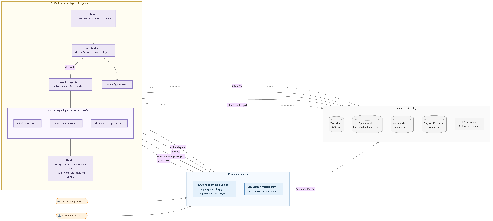
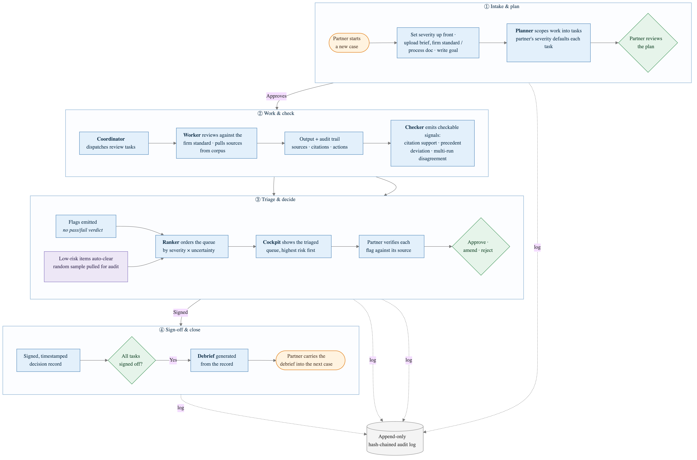
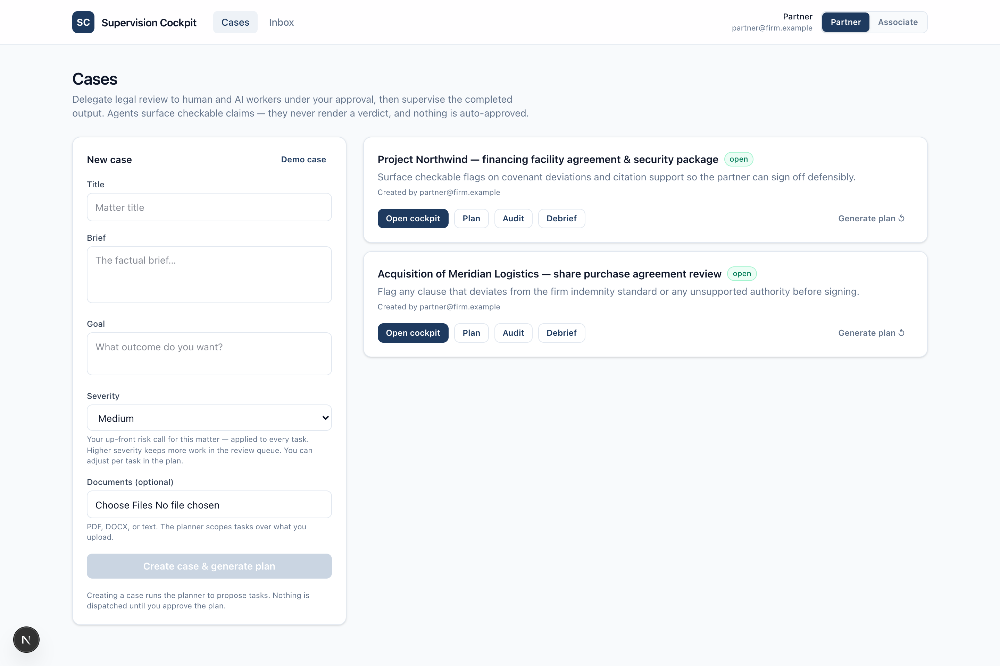
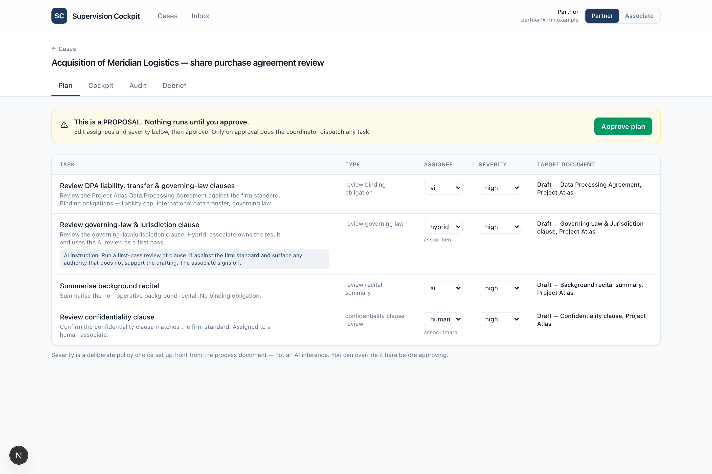
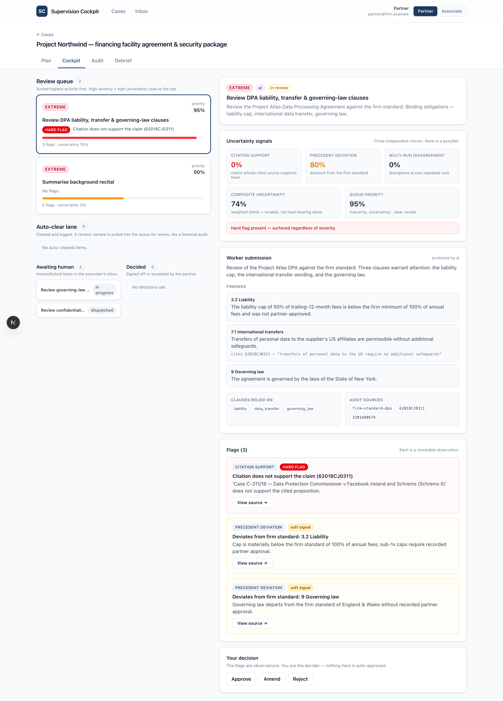
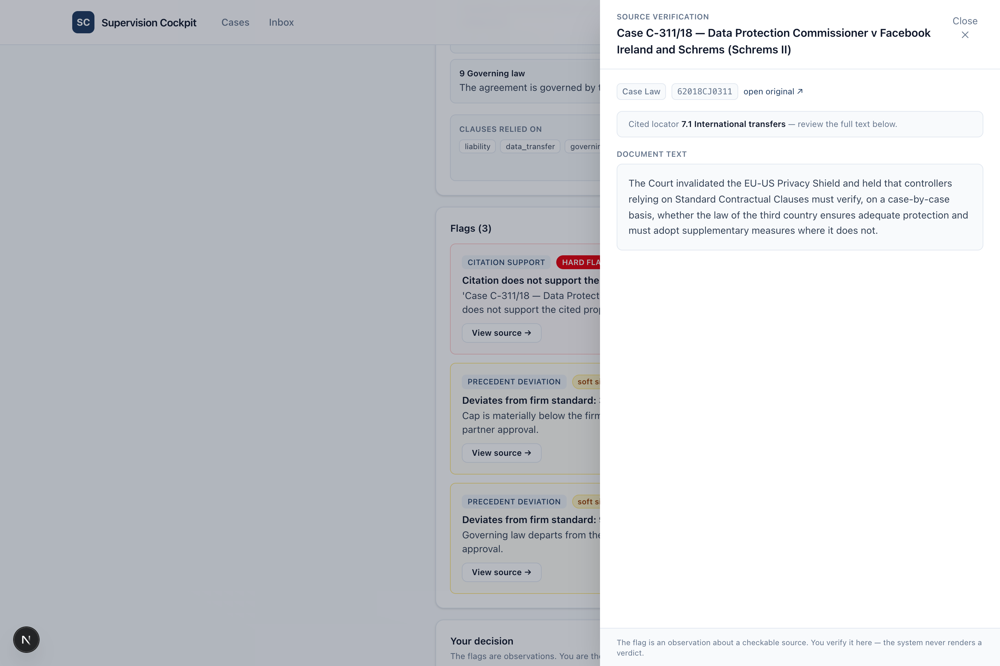
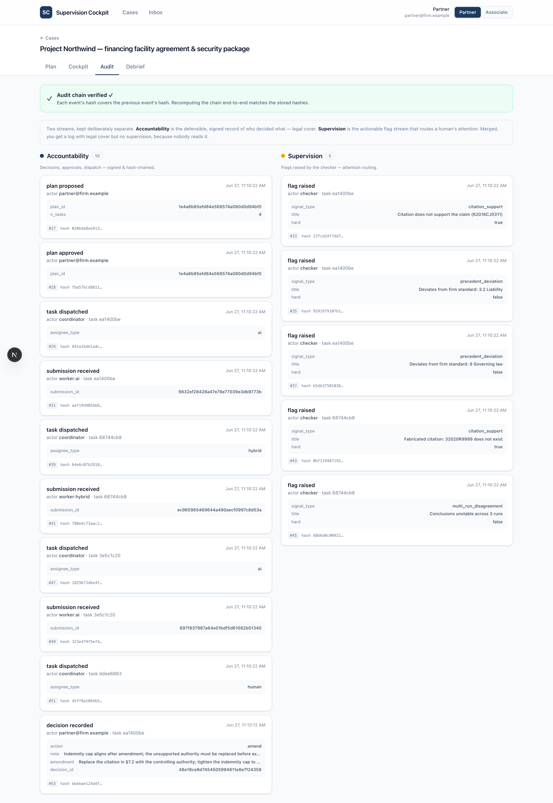
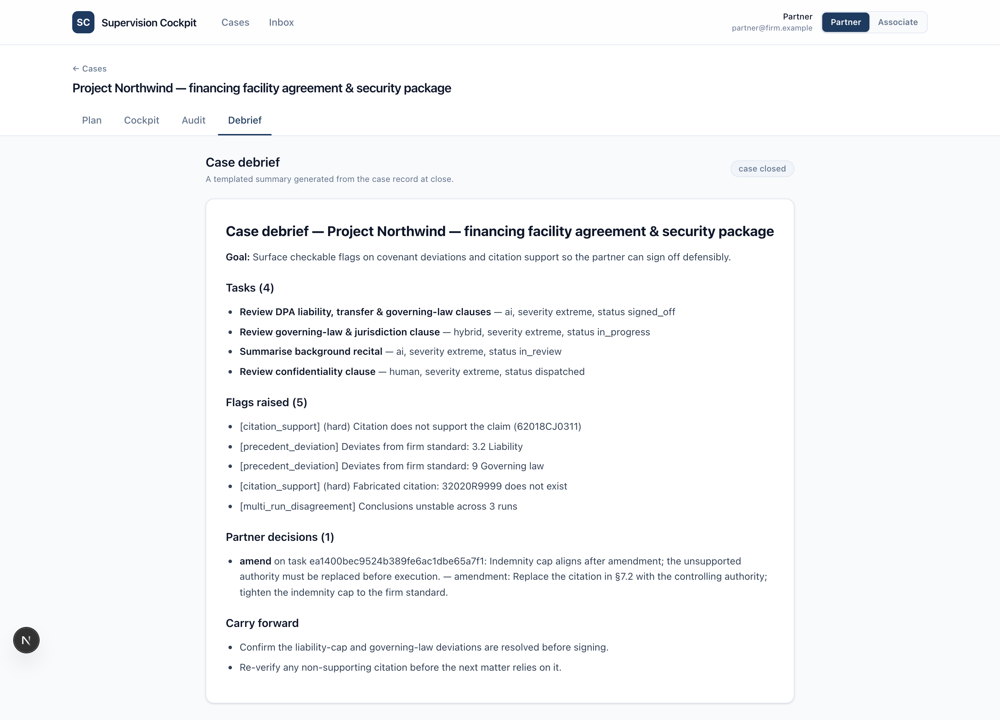
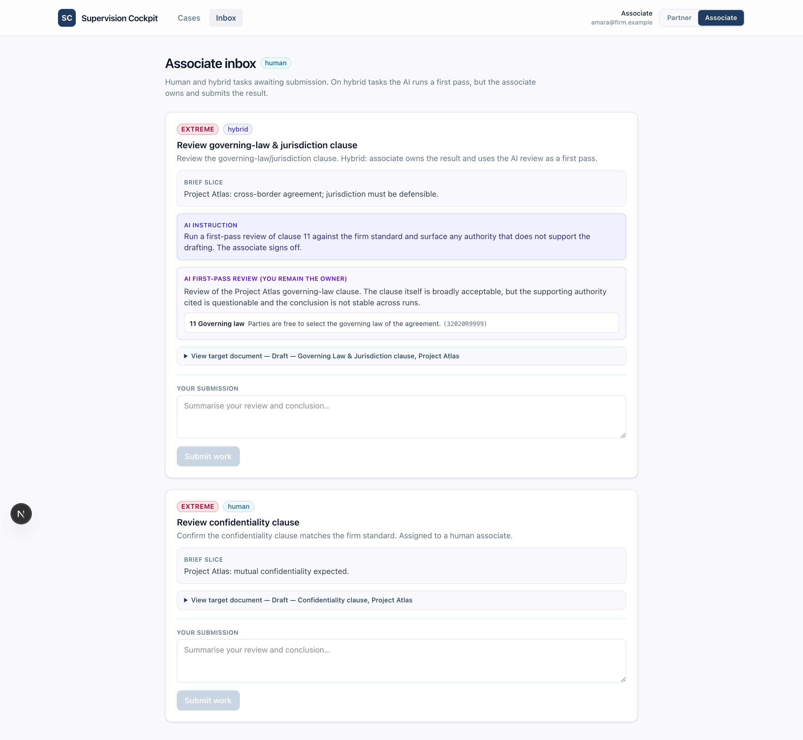

# Supervision Cockpit for Human and AI Legal Teams

**Hack the Law (Cambridge) · Clifford Chance track** — *How do we supervise legal AI agents?*

An end-to-end demo that delegates legal work under partner approval, then **supervises** it: it
triages completed AI output by a risk signal, surfaces **checkable flags** (never verdicts), and
records **defensible, signed sign-off** — so a supervising partner stays accountable without
manually reviewing every output.

> Agents surface checkable claims. They never render verdicts. The human decides.

Runs **fully offline** in mock mode (no API key) — the LLM sits behind a provider that replays
fixtures, so the demo never depends on a live model.

## Architecture
Three layers — presentation, orchestration (the AI agents), and data/services — with depth
concentrated in the supervision spine (worker → checker → ranker → cockpit → audit). See
[`architecture.md`](architecture.md) for the full design.



The control loop, end to end — every transition writes to the append-only, hash-chained audit log:



## Screenshots
A walk through the demo path, partner first.

**Cases — delegate under approval.** Create a case, set severity up front, attach documents. Nothing
is dispatched until you approve a plan.



**Plan — the approval gate.** The planner *proposes* tasks with assignee type and severity; the
partner edits and approves. Only on approval does the coordinator dispatch anything.



**Cockpit — the supervision centrepiece.** The queue is triaged by risk. The flag panel shows the
**three independent uncertainty signals** (never fused into one verdict), the worker's submission,
and each checkable flag — with approve / amend / reject controls. Nothing is auto-approved.



**One-click source verification.** Every flag links straight to its cited source (or states plainly
that a fabricated citation has no such source). The agent surfaces a checkable claim; the human
verifies it in seconds.



**Audit — accountability vs supervision, kept separate.** A signed, hash-chained record of who
decided what (left) is rendered apart from the actionable flag stream (right). The chain is verified
end to end.



**Debrief & associate inbox.** At close, a debrief is generated from the case record. Human and
hybrid tasks land in the associate inbox, with the hybrid AI instruction shown inline.

| Debrief | Associate inbox |
|---|---|
|  |  |

## Demo video
_Coming soon._

## Quick start

```bash
make install        # backend (uv) + frontend (npm) deps
make dev            # FastAPI on :8000 + Next.js on :3000
# then open http://localhost:3000
```

Or run the two halves separately:

```bash
make backend        # cd backend && uv run uvicorn app.main:app --reload   (:8000)
make frontend       # cd frontend && npm run dev                            (:3000)
make test           # backend tests, offline
```

## What's here
- `architecture.md` — the design spine (read this first).
- `current_progress.md` — running build log. `todo.md` — backlog. `marketing.md` — GTM.
- `backend/` — FastAPI + SQLite + the worker/checker/ranker/planner/coordinator/debrief services.
- `frontend/` — Next.js cockpit (queue, flag panel, approve/amend/reject), plan approval, associate
  inbox, audit view, debrief.
- `system-design/` — the original technical brief and diagrams.

## The demo path
Create a case → planner proposes tasks → edit + **approve the plan** (gate) → an AI task runs and one
lands in the associate inbox → cockpit shows the queue sorted by risk → open the top item, see the
failed-citation and template-deviation flags, click through to each source → **approve with an
amendment** (signed) → audit view shows the plan approval + the decision, separate from the flags →
the auto-clear lane shows a randomly sampled item → close the case → debrief generates.

To use a real model: set `ANTHROPIC_API_KEY` and `PROVIDER_MODE=real` in `backend/.env`.
